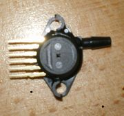
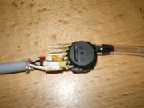
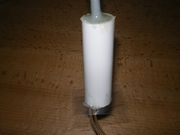
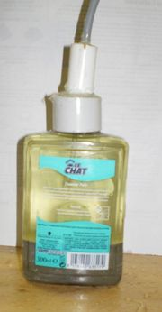
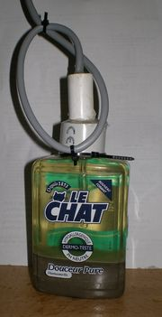
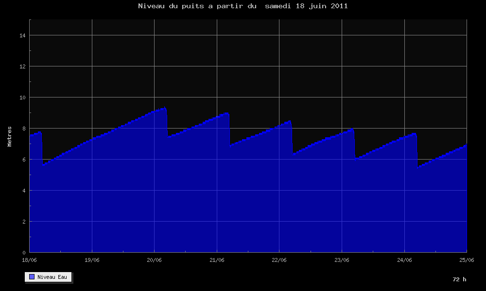

<h1>Réalisation d'un capteur de niveau d'eau pour un puits</h1>

L'objectif est de pouvoir mesurer régulièrement le niveau d'eau dans un puits pour suivre son évolution, et à terme de pouvoir le faire de façon automatique. La solution initiale était d'utiliser un double décamètre auquel était suspendu un poids. Cela devient vite contraignant si l'on souhaite faire une mesure par jour. L'utilisation d'un capteur installé de façon permanente s'impose donc rapidement. Je suis donc parti à la recherche d'un capteur qui permettrait de convertir le niveau d'eau en signal électrique. J'ai envisagé :

    un capteur à ultrason qui mesurerait la distance entre le haut du puits et la surface de l'eau. je n'ai rien trouvé de simple, peu couteux et facile à mettre en Œuvre.
    des capteurs de conductivité à installer sur toute la hauteur du puits : cela risque d'être sensible, à l'humidité ambiante, aux dépots sur la sonde, à l'oxydation des contacts et de ne pas être fiable dans le temps.
    une mesure par un capteur de pression placé dans le fond du puits : cette solution semble prometteuse puisqu'on trouve déjà des capteurs industriels prêts à poser (pour plusieurs centaines d'euros) mais aussi de nombreux composants électroniques permettant de mesurer une pression.

Après quelques recherche j'ai identifié un capteur de pression de chez Freescale (ex Motorola) qui s'appelle maintenant NXP portant la référence MPX4250A. Vous pouvez consulter sa datasheet

Ses avantages sont :

    mesure d'une pression absolue (avoir une référence de pression au fond du puits est délicat)
    une alimentation 5V suffit
    gamme de pression de 0 à 2,5 bar. une fois enlevée la pression atmosphérique ( 1,013 bar en moyenne) il reste une plage d'environ 1,5 bar soit une plage de mesure de hauteur d'eau d'environ 15 m.

<h2>Mise en oeuvre</h2>

Le capteur est destiné à être placé au fond du puits, en étant soumis à la pression de l'eau. Il faut cependant éviter que les contacts électriques soient au contact de l'eau et aussi la membrane de mesure de pression.

Afin d'avoir un capteur aussi petit que possible, il faut commencer par couper ses "oreilles" de fixation.

Ensuite on utilise un câble de 20 m 4 conducteurs que l'on soude sur les broches du capteurs. 2 fils sont utilisés pour l'alimentation 0V (broche 2), +5V (broche 3), les 2 autres pour la mesure 0V (broche2) et Vout (broche 1). L'intérêt d'avoir deux fils de masse un pour l'alimentation l'autre pour la mesure est de diminuer le niveau des parasites ainsi que les effets de la résistance du câble et de de la consommation du capteur. Les autres broches sont inutilisées et laissées en l'air. On en profite pour souder des capacités de découplage comme indiqué dans la datasheet. On obtient quelque chose qui ressemble à la photo ci-joint. Notez le petit tuyeau (style tuyeau d'aquarium) connecté sur la prise de pression. Il est conseillé de vérifier que le capteur fonctionne à ce stade, car après l'étape suivante il sera trop tard. Alimenté en 5 V, la tension de sortie doit être d'environ 2 V à la pression atmosphérique courante.

Ensuite nous allons placer le tout dans un tube PVC de diamêtre interne 14mm et noyer le circuit dans de la colle epoxy. Il est conseillé d'utiliser de l'epoxy lente avec un temps de prise de plusieurs heures et de vérifier l'absence de poche d'air dans le tube PVC lors du remplissage. On obtient alors un ensemble ci-dessous. On note sur la photo la présence de la feuille de plastique pour boucher temporairement le fond du tube ainsi que le tuyeau servant de prise de pression.

Le capteur est maintenant isolé de l'eau, sauf en ce qui concerne la prise de pression. Pour cela il faut utiliser un autre liquide qui serve d'interface et dans lequel aucun microorganisme ne risque de se développer. L'idée est d'utiliser de l'huile alimentaire (afin que le puits ne soit pas polluée en cas de fuite) dans un flacon. Afin d'être sur que la pression de l'huile soit égale à la pression extérieur, il faut choisir un flacon en plastique souple déformable. Un flacon de savon liquide pour se laver les mains fait parfaitement l'affaire : sa forme parallélépipédique lui permet se déformer ce qui ne serait pas le cas d'un flacon cylindrique. Il ne faut pas utiliser de flacon cylindrique, sa forme l'empêcherait de se déformer sous la pression. Avant de le remplir d'huile on coule dedans du mortier sur environ 25% de son volume afin qu'il coule dans l'eau.

Il faut maintenant fermer la bouteille en plaçant le capteur dans le goulot et en noyant le tout dans de la colle époxy moulé dans un tube de PVC de 40 mm. C'est l'opération la plus délicate car il faut veiller à ce qu'aucune déformation ne s'exerce sur la bouteille pendant la prise de la colle : cela introduirait une erreur de mesure lorsque la pression ambiante est faible (ie proche de la pression atmosphérique).

Voila c'est terminé, quelques "Serflex" bien placés aideront peut être à remonter tous les morceaux en cas de défaillance de la colle.

<h2>Étalonnage</h2>
<h3>Théorie</h3>

D'après la datasheet il est que :VOUT = Vs* (0.004 x P-0.04) ± Error avec P en kPa et Error variant entre -5 et +5 kPa .

Souhaitant exprimer P en Pa (Rappel : 1 millibar = 1 hecto Pascal = 100 Pa), en mettant le coeff 0.004 en facteur la formule devient :
Vout=Vsx0.004x(P-10000+Offset)/1000

avec Vs = 5V, P la pression à laquelle est soumise le capteur en Pascal, et l'Offset du Capteur compris entre - et + 5000 Pa.

D'autre part on sait aussi que :
P=Pqfe+hρg

ou Pqfe est la pression atmosphérique en pascal, h la hauteur d'eau, ρ la masse volumique de l'eau (1000 kg/m3) et g l'accélération de la pesanteur (9.81 m/s2) On a aussi :
Pqfe=Pqnh-Alt*11,7

ou Pqnh est la pression au niveau de la mer (101325 Pa en moyenne) et Alt l'altitude du lieu en mètres.

On obtient donc :
h=( (Vout*1000)/(Vs*0.004) +10000-Offset)/ρg + (-Pqnh+11,7xAlt)/ρg

On peut supposer que Pqnh=constante=101325 Pa . Vu les variations de cette valeur dues à la météo (±2000 Pa), cela revient à faire une erreur de mesure sur la hauteur d'eau de ±2000/ρg=±2000/(9.81*1000)=±20 cm .
<h3>Pratique</h3>

D'après le paragraphe précédent avec Vs = 5V, ρ=1000 kg/m3 et g= 9,81 m/s2 on obtient :
h=(50000*Vout +10000)/9810 - k avec h en mètres et Vout en Volt

Il suffit donc de faire quelques mesures pour déterminer k. Dans mon cas particulier (altitude de 166 m) j'ai mesuré k=10,33 m qui est la valeur théorique au niveau de la mer. Cela signifie que l'offset du capteur est compensé par l'altitude du lieu (166 m).

<h2>Affichage des données</h2>

On peut utiliser l'outil de son choix pour afficher la hauteur. 

On peut ensuite les afficher à l'aide d'outils standard.

 
